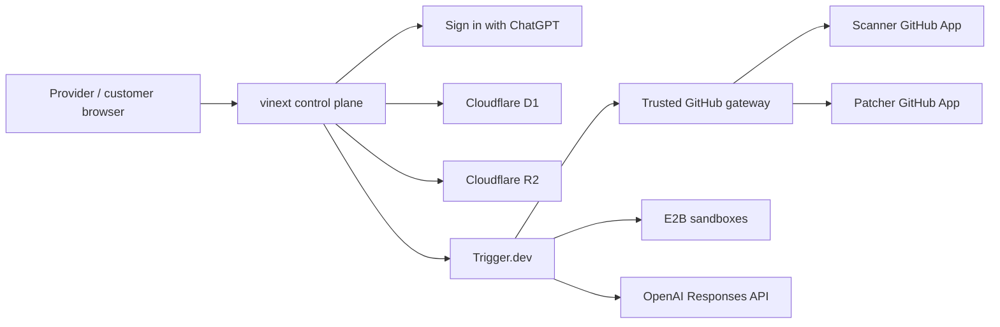

# API Migration Autopilot

Invite-only infrastructure for API providers to sponsor real customer SDK
migrations. The product acquires provider evidence, assesses selected GitHub
repositories with read-only access, produces evidence-backed changes, validates
them in isolation, and publishes only a customer-approved draft pull request.
It never merges or deploys code.

This repository is a production-alpha foundation, not a demo. It contains no
seeded funnel data, simulated jobs, or mock GitHub results. An action that needs
an unconfigured external service is visibly unavailable.

## Implemented production slice

- Sign in with ChatGPT identity and persisted, organization-scoped roles
- Separate provider, customer, and internal-operations application shells
- Provider campaign creation and immutable specification approval/launch
- Independent Stripe Node `20.3.x → 22.1.x` reference campaign backed by
  fetched, hashed public evidence
- Real email invitations through Resend, with exact-recipient acceptance and
  explicit provider lifecycle-sharing consent
- Separate Scanner and Patcher GitHub App installation flows
- GitHub installation ownership verification, just-in-time repository-scoped
  tokens, webhook authentication, and delivery deduplication
- Durable assessment task source for Trigger.dev
- Real bounded repository reads, Stripe dependency resolution, deterministic
  findings, source-minimized signed callbacks, and persisted customer-only
  impact reports
- Deterministic Stripe codemods, patch hashing/security checks, constrained
  OpenAI and E2B adapters, and idempotent draft-PR publication primitives
- D1 persistence, R2 encrypted-artifact boundary, tenant filters, and
  hash-chained audit events

The patch-generation, sandbox-validation, exact-hash approval, PR publication,
post-merge verification, and retention automation workflows are the next
implementation phases. See [CLAUDE_HANDOFF.md](./CLAUDE_HANDOFF.md).

## Architecture



The app is a modular monolith. Browser commands terminate in server routes;
public machine ingress is limited to authenticated GitHub webhooks and signed
workflow callbacks. Repository tokens are minted just in time and are never
persisted, sent to a model, or sent to a sandbox.

Detailed design is in [docs/architecture.md](./docs/architecture.md), and the
security analysis is in [docs/threat-model.md](./docs/threat-model.md).

## Local setup

Requirements:

- Node.js 24
- npm 11+

```bash
npm ci
Copy-Item .env.example .env.local
npm run dev
```

Local D1 and R2 state is kept under ignored `.wrangler/` storage. Development
identity works only when `NODE_ENV` is not `production`,
`ALLOW_DEV_AUTH=true`, and `DEV_USER_EMAIL` is configured.

Configure integrations in this order:

1. Scanner GitHub App
2. Trigger.dev project and matching callback secret
3. Resend
4. Patcher GitHub App
5. E2B
6. OpenAI

The UI reports readiness without exposing secret values.

After creating the Trigger.dev project, run `npm run trigger:dev` for local task
execution and `npm run trigger:deploy` to publish the production task version.

## Verification

```bash
npm run typecheck
npm run lint
npm run test:unit
npm test
npm run audit:production
```

`npm test` runs strict type checking, domain/security/migration tests, a full
production bundle, and compiled-route assertions.

## Database

The Drizzle schema is in `db/schema.ts`; the generated migration is in
`drizzle/0000_sleepy_landau.sql`. The hosted runtime applies the versioned
migration idempotently through `db/runtime.ts`. Generate a new migration after
schema changes:

```bash
npm run db:generate
```

Never edit an applied migration. Add a new revision and test it against a copy
of production data.

## Operations

See [docs/operations-runbook.md](./docs/operations-runbook.md) for integration
setup, failure classification, safe retries, and incident response.

## Status

Version: `0.1.0-alpha.1`.

Private hosted control plane:
[api-migration-autopilot.young-corgi-3741.chatgpt.site](https://api-migration-autopilot.young-corgi-3741.chatgpt.site).
Access is owner-only until collaborators are explicitly added.

This is a real but incomplete private alpha. External credentials and partner
accounts are intentionally not committed. The system fails closed when they
are absent.
