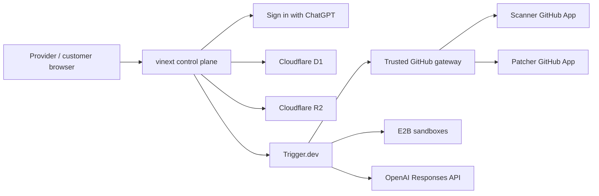

# API Migration Autopilot

Invite-only infrastructure for API providers to sponsor real customer SDK
migrations. The product acquires provider evidence, assesses selected GitHub
repositories with read-only access, produces evidence-backed changes, validates
them in isolation, and publishes only a customer-approved draft pull request.
It never merges or deploys code.

This repository is a production-alpha foundation, not a demo. It contains no
seeded funnel data, simulated jobs, or mock GitHub results. An action that needs
an unconfigured external service is visibly unavailable.

## Implemented production slice

- Sign in with ChatGPT identity and persisted, organization-scoped roles
- Separate provider, customer, and internal-operations application shells
- Provider campaign creation and immutable specification approval/launch
- General provider artifact intake for Markdown, HTML, PDF, JSON/YAML, SDK
  diffs, and OpenAPI; raw and extracted evidence are encrypted and hashed
- Provider-declarative rule authoring with evidence, limitations, before/after
  examples, review submission, exact-hash approval, safe revision, pause, and
  archive controls
- Provider-owned domain verification through an expiring DNS TXT challenge
- Independent Stripe Node `20.3.x → 22.1.x` reference campaign backed by
  fetched, hashed public evidence
- Real email invitations through Resend, with exact-recipient acceptance and
  explicit provider lifecycle-sharing consent
- Separate Scanner and Patcher GitHub App installation flows
- GitHub installation ownership verification, just-in-time repository-scoped
  tokens, webhook authentication, and delivery deduplication
- Durable assessment task source for Trigger.dev
- Spec-driven Node.js/TypeScript assessment for approved provider rules,
  including npm, pnpm, Yarn Classic/Berry, lockfiles, and workspaces
- TypeScript/ts-morph symbol indexing in a no-network E2B analyzer that never
  executes repository code, plus optional consent-gated model classification
- Source-minimized signed callbacks with durable exact-result receipts,
  concurrent-delivery exclusion, exact replay responses, encrypted assessment
  manifests, and customer-only scanned/skipped scope
- Deterministic Stripe codemods, patch hashing/security checks, constrained
  OpenAI and E2B adapters, and idempotent draft-PR publication primitives
- D1 persistence, R2 encrypted-artifact boundary, tenant filters, and
  hash-chained audit events
- Versioned external-model-processing consent with grant/revoke commands and a
  fail-closed re-check immediately before any snippet leaves the control plane
- A durable patch workflow that acquires source at the recorded commit, runs the
  deterministic codemod inside customer-authorized paths only, proves syntax
  with the TypeScript parser, and returns a strictly validated result
- Independent control-plane re-validation of every patch: a patch that fails
  allowed-path, workflow-file, binary, size, base-commit, or hash checks is
  never persisted as reviewable work
- Customer patch review with independently encrypted, expiring per-file
  artifacts; the initial page contains metadata only and self-hosted Monaco
  decrypts one tenant-checked file on demand with a keyboard-readable fallback
- Evidence, validation results, integrity issues, unresolved risk, and the
  exact canonical patch SHA-256 remain visible throughout review
- Exact-hash approval bound to an approver membership, then idempotent draft-PR
  publication that rechecks the default-branch commit immediately before writing
- Post-merge verification scans that keep `merged` and `verified` distinct
- Retention automation: a 24-hour interrupted-run sweeper, 30-day artifact
  expiry, storage-verified deletion, retry with backoff, a dead-letter state,
  customer export, and customer-requested early erasure
- Internal operations with redacted run health and usage, immutable safe
  retries, deletion recovery, audit-chain verification, and provider branding
  approval; an allowlisted founder receives one audited internal workspace on
  first sign-in without manual database provisioning
- Customer-approved support requests scoped to one run and at most 24 hours;
  every source-bearing read is tenant-checked, expiry-checked, and audited
- A fail-closed telemetry boundary for OpenTelemetry, Sentry, and metadata-only
  PostHog, plus persisted operational alerts with acknowledge/resolve controls
- Private-cache browser responses, a restrictive content policy, rate limits
  on expensive operations, accessibility checks across every product view, and
  production bundle budgets

The remaining release condition is live external-account acceptance. No local
test is represented as proof of a real GitHub, Trigger.dev, E2B, OpenAI,
Resend, DNS, pull-request, merge, or deletion run.

## Architecture



The app is a modular monolith. Browser commands terminate in server routes;
public machine ingress is limited to authenticated GitHub webhooks and signed
workflow callbacks. Repository tokens are minted just in time and are never
persisted, sent to a model, or sent to a sandbox.

Detailed design is in [docs/architecture.md](./docs/architecture.md), and the
security analysis is in [docs/threat-model.md](./docs/threat-model.md).

## Verifying the invariants

`npm test` runs type checking, the unit and integration suites, a production
build, and assertions against the built worker bundle. The integration suite in
`tests/control-plane.test.ts` and `tests/provider-authoring.test.ts` run the real
data layer against SQLite and an in-memory object store. They cover cross-tenant
refusal, role enforcement, provider evidence encryption, SSRF controls,
consent gating, unauthorized-path and workflow-file refusal, exact-hash
approval, finalized PR identity, provider privacy, and deletion proof.

## Local setup

Requirements:

- Node.js 24
- npm 11+

```bash
npm ci
Copy-Item .env.example .env.local
npm run dev
```

Local D1 and R2 state is kept under ignored `.wrangler/` storage. Development
identity works only when `NODE_ENV` is not `production`,
`ALLOW_DEV_AUTH=true`, and `DEV_USER_EMAIL` is configured.

Configure integrations in this order:

1. Scanner GitHub App
2. Trigger.dev project and matching callback secret
3. Resend
4. Patcher GitHub App
5. E2B
6. OpenAI

The UI reports readiness without exposing secret values.

After creating the Trigger.dev project, run `npm run trigger:dev` for local task
execution and `npm run trigger:deploy` to publish the production task version.

## Verification

```bash
npm run typecheck
npm run lint
npm run test:unit
npm run eval:assessment
npm test
npm run audit:production
```

`npm test` runs strict type checking, domain/security/migration tests, a full
production bundle, and compiled-route assertions.

## Database

The Drizzle schema is in `db/schema.ts`; generated migrations are in
`drizzle/`. The hosted runtime applies every versioned migration idempotently
through `db/runtime.ts`. Generate a new migration after schema changes:

```bash
npm run db:generate
```

Never edit an applied migration. Add a new revision and test it against a copy
of production data.

## Operations

See [docs/operations-runbook.md](./docs/operations-runbook.md) for integration
setup, failure classification, safe retries, and incident response.

## Status

Version: `0.4.0-alpha.1`.

Private hosted control plane:
[api-migration-autopilot.young-corgi-3741.chatgpt.site](https://api-migration-autopilot.young-corgi-3741.chatgpt.site).
Access is owner-only until collaborators are explicitly added.

This is a real private production alpha with live external acceptance still
pending. External credentials and partner accounts are intentionally not
committed. The system fails closed when they are absent. See
[docs/acceptance-audit.md](./docs/acceptance-audit.md) for the exact boundary.
